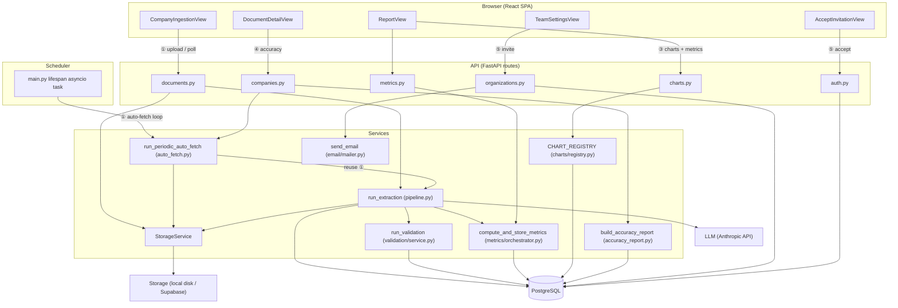
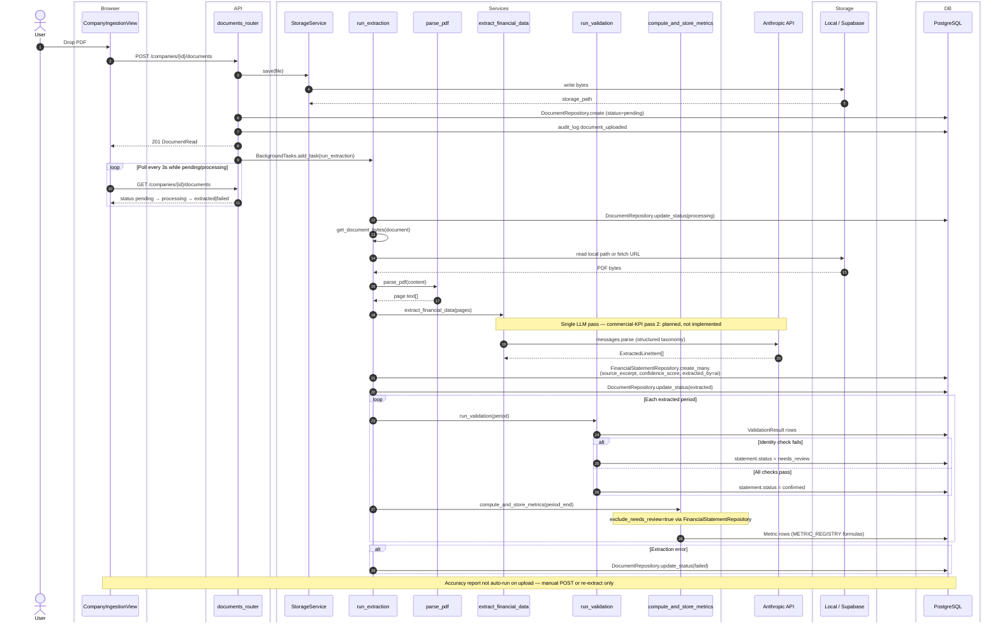
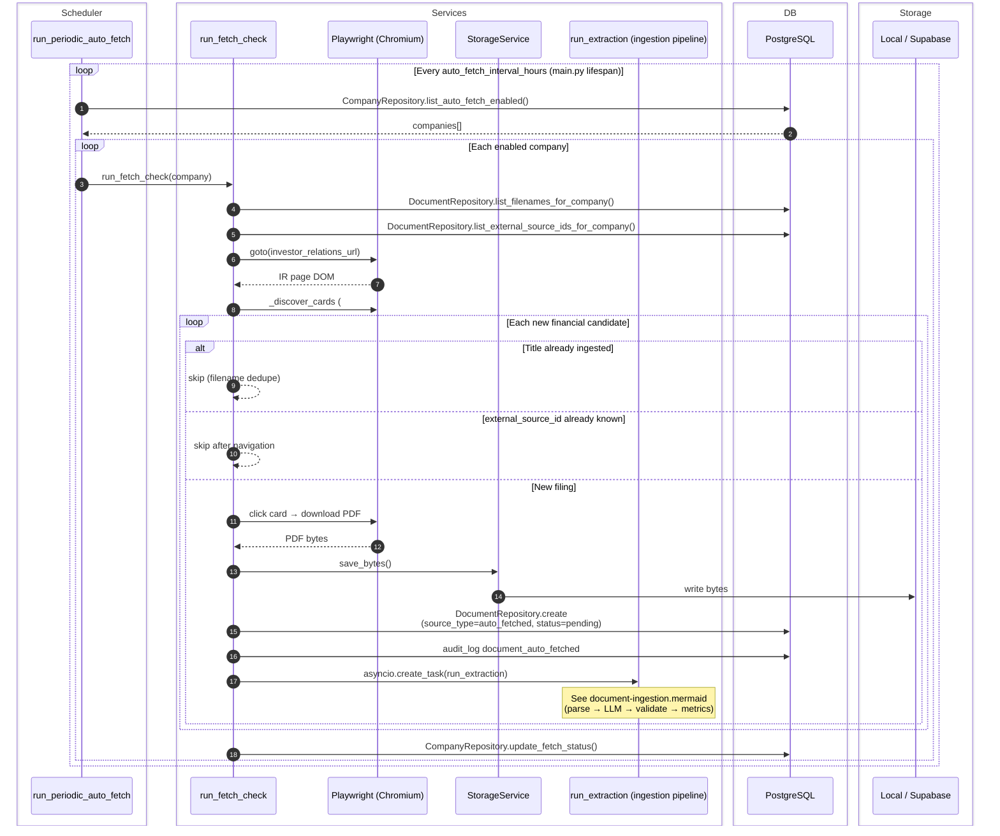
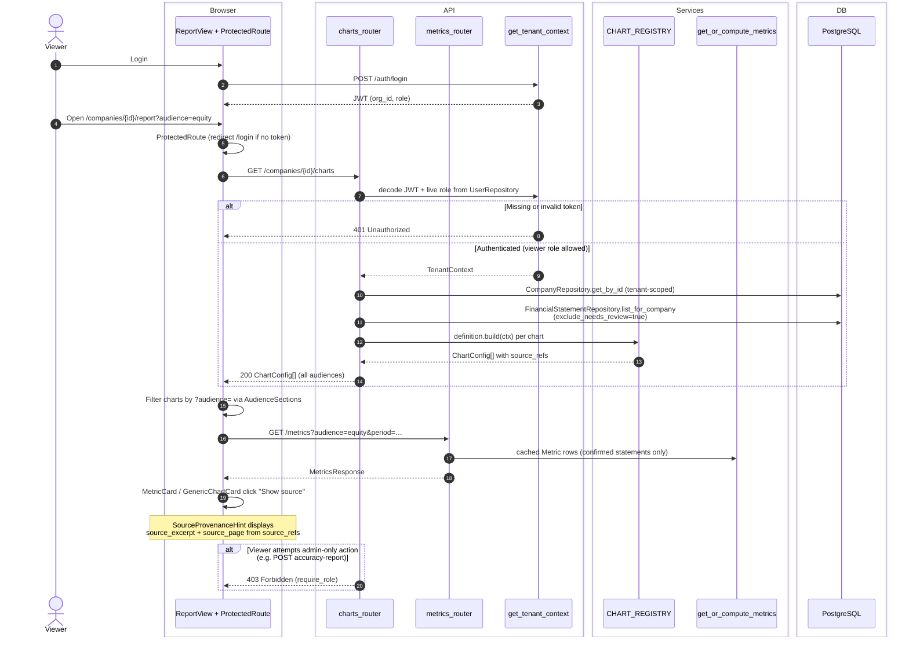
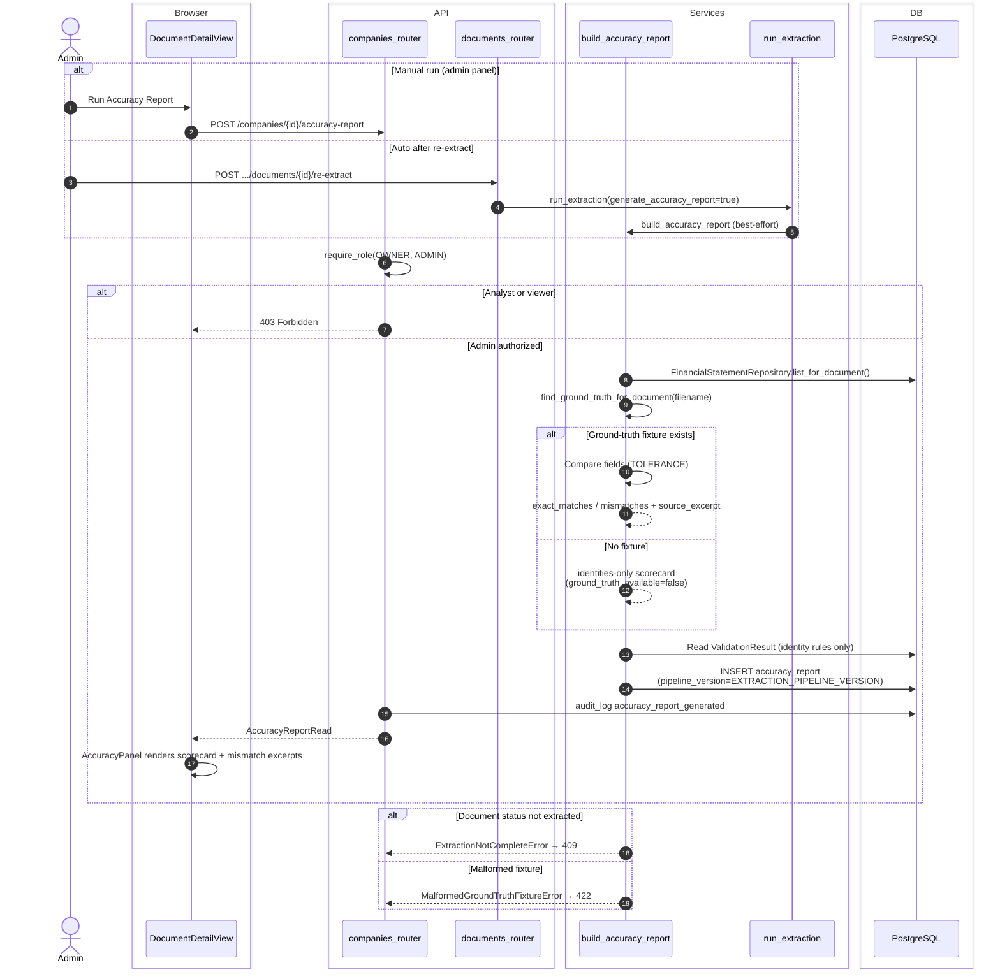
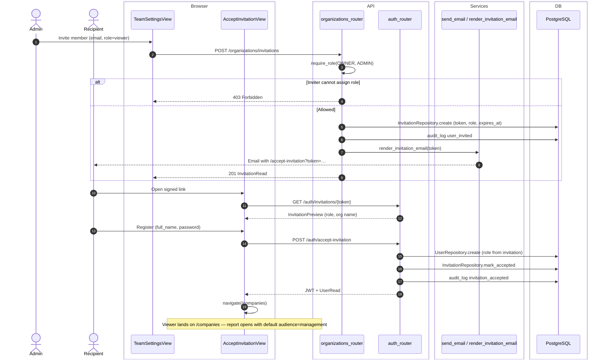

# Assiduous Board Report Platform

📺 [Watch the demo video](https://www.youtube.com/watch?v=-7wElUXPDuk)

An AI-native, multi-tenant financial board reporting platform built for Assiduous. Organizations
onboard companies, ingest financial filings (manual upload today, automated fetch for supported
sources), and receive extracted metrics, interactive charts, and AI-generated narrative commentary
across four stakeholder views: **Management**, the **Board**, **Equity Investors**, and **Credit
Providers**.

**Senus PLC** — an Irish natural-capital software company listed on Euronext Access Dublin — is the
first case study driving the build, but the data model and extraction pipeline are company-agnostic
by design.

See [`ARCHITECTURE.md`](./ARCHITECTURE.md) for the full domain model and module layout.

---

## What the platform does today

| Area | Status |
|---|---|
| Multi-tenant auth (register, login, JWT, 2FA) | ✅ |
| Team invitations + role-based access (owner / admin / analyst / viewer) | ✅ |
| Company CRUD, document upload, async LLM extraction | ✅ |
| Standardized financial taxonomy → `FinancialStatement` rows with source citations | ✅ |
| Computed metrics (growth, profitability, cash, solvency, returns) | ✅ |
| Four audience-specific dashboard views with live charts | ✅ |
| AI narrative insights per audience / period | ✅ |
| Human override of extracted figures + audit trail | ✅ |
| Budget vs. actual, industry benchmarks, threaded comments on insights | ✅ |
| PDF board-pack export | ✅ |
| Automated IR-page fetch (Senus-style sources via Playwright) | ✅ MVP |
| Billing, OAuth/SSO, S3 storage, Celery queue | 🔜 Phase 2 |

---

## Architecture

Sequence and flow diagrams live in [`docs/architecture/`](./docs/architecture/) as standalone
`.mermaid` files (GitHub renders the copies below natively).

### Component map

High-level map of major components and which flows connect them.



### 1. Document upload & extraction

Manual PDF upload → storage → async `run_extraction` → single LLM pass → validation → metric cache; frontend polls until a terminal document status.



### 2. Scheduled IR-site ingestion

`run_periodic_auto_fetch` crawls enabled companies' investor-relations pages, dedupes, downloads new PDFs, then hands off to the ingestion pipeline.



### 3. Role-based report access

Authenticated users fetch chart configs and cached metrics built only from confirmed statements; provenance excerpts surface on click.



### 4. Accuracy verification

Admin scores extracted values against optional ground-truth fixtures and recorded accounting-identity checks.



### 5. Viewer invitation

Owner/admin creates a signed invitation link; recipient registers and receives a JWT scoped to the invited role.



---

## Architecture overview

The system follows a classic three-tier SaaS layout: a React SPA talks to a FastAPI backend, which
persists tenant-scoped data in PostgreSQL and delegates slow work (PDF extraction, auto-fetch) to
background tasks.

.png>)

### Multi-tenancy

Every data-bearing table carries `organization_id` (directly or via `company_id`). A FastAPI
dependency (`TenantContext` in `backend/app/core/deps.py`) decodes the JWT, extracts `org_id`, and
injects it into every authenticated route. Repository methods require `organization_id` as an
explicit parameter so tenant filtering is enforced at the data-access layer rather than scattered
through route handlers.

### Extraction → metrics → insights pipeline

1. **Upload** — a PDF is stored via `StorageService`, a `Document` row is created with
   `status = pending`, and a `BackgroundTask` kicks off extraction.
2. **Extract** — `pypdf` parses page text; the Anthropic SDK (`messages.parse`) returns structured
   JSON keyed to a fixed taxonomy (`backend/app/services/extraction/taxonomy.py`). Each field
   includes a verbatim `source_excerpt`, page number, and `confidence_score`.
3. **Store** — values land in `FinancialStatement` rows tagged `extracted_by = ai`.
4. **Compute** — `services/metrics/orchestrator.py` derives the assessment-required metrics (YoY/MoM
   growth, margins, DSCR, ROCE, cash runway, etc.) and caches them in `Metric` rows.
5. **Narrate** — `services/insight/generator.py` feeds computed metrics (plus prior-period context)
   to the LLM with audience-specific prompts, caching one `Insight` per (company, period, audience).
6. **Present** — `ReportView` renders audience-filtered metric cards, Recharts charts, and the
   `InsightPanel` (with optional human comments alongside AI text).

### Auditability

Sensitive mutations — manual overrides, invitations, exports, password changes, org transfers — write
an `AuditLog` entry with `user_id`, `action`, and `extra_data`. Override history is also queryable
per `FinancialStatement` row from the financial data review screen.

---

## Technology stack

| Layer | Choice | Notes |
|---|---|---|
| **Backend** | Python 3.12, FastAPI | Async-first REST API |
| **ORM / migrations** | SQLAlchemy 2.x (async) + Alembic | 17 migration revisions |
| **Database** | PostgreSQL 15 | JSONB for flexible fields; Docker Compose in dev |
| **Auth** | JWT (`python-jose`) + bcrypt (`passlib`) | Org ID embedded in token; TOTP 2FA via `pyotp` |
| **Frontend** | React 18, TypeScript, Vite | SPA with React Router |
| **Charts** | Recharts | Margin/revenue trends; EBITDA→FCF waterfall (stacked-bar technique) |
| **AI** | Anthropic SDK (`claude-opus-4-8` default) | Structured extraction + narrative generation |
| **PDF parsing** | `pypdf` | Page-level text extraction before LLM call |
| **PDF export** | WeasyPrint + Jinja2 templates | Server-side board-pack rendering |
| **Email** | `fastapi-mail` over SMTP | Invitations, password reset |
| **Auto-fetch** | Playwright (Chromium) | Investor-relations page scraping (Senus-confirmed structure) |
| **File storage** | `StorageService` interface | Local disk in dev; swappable to S3 in production |
| **Async work** | FastAPI `BackgroundTasks` | Extraction + auto-fetch; Celery planned for Phase 2 |

---

## Validation approach

The assessment requires being able to **stand over every AI-generated number**. The platform
implements a layered validation strategy rather than trusting LLM output blindly.

### 1. Source traceability at extraction time

Every AI-extracted `FinancialStatement` row stores:

- `source_excerpt` — a verbatim quote (≤ 200 chars) from the filing text
- `source_page` — the PDF page the value came from
- `confidence_score` — 0–1 self-assessment from the model
- `document_id` — FK back to the uploaded filing

The extraction prompt explicitly forbids guessing: *"If a field cannot be found, omit it entirely —
never guess, estimate, or hallucinate a value."*

### 2. Human review and override in the UI

`CompanyFinancialDataView` lets analysts inspect extracted figures, edit incorrect values, and view
per-field override history. An override:

- Updates the `FinancialStatement` value
- Sets `extracted_by = manual_override` and clears the AI confidence score
- Writes an `audit_log` entry (`financial_statement.manual_override`)

### 3. Deterministic metric computation

Dashboard metrics are **not** LLM-generated. They are computed in Python from stored line items
(`services/metrics/`), using explicit formulas in modules for growth, profitability, cash, solvency,
and returns. The LLM insight layer receives only these pre-computed numbers, with a system prompt
rule: *"Base every claim strictly on the metrics provided. Never invent a number that isn't given."*

### 4. End-to-end checks performed during development

| Check | How |
|---|---|
| Extraction against real Senus filings | Upload PDFs via ingestion UI; compare extracted revenue, EBITDA, customer count against published figures |
| Currency detection | Unit tests in `tests/test_extraction_currency.py`; company currency synced post-extraction |
| Metric formulas | Manual spot-checks on dashboard cards vs. raw financial data table for the same period |
| Tenant isolation | Integration tests for invitation/transfer flows; all repository queries require `organization_id` |
| Invitation / org-transfer edge cases | `tests/test_accept_invitation_deletion.py` (sole-member org deletion, ownership blockers) |
| Insight grounding | Review generated narrative against the metric payload shown in the same report view |

### 5. Known limitations (documented, not hidden)

- Auto-fetch is a **heuristic MVP** for one confirmed IR-site structure (Senus); it is not a
  general exchange-filing scraper.
- Low-confidence fields are surfaced in the data table but not automatically blocked from metric
  computation — analysts are expected to override before board circulation.
- There is no organization-wide audit log browser yet; history is per financial line item and in the
  database for compliance queries.

---

## AI-assisted development workflow

This project was built iteratively with **Cursor IDE** and **Claude** (via Cursor Agent and Claude
Code) as the primary AI coding assistants, with the developer reviewing and testing every change.

### How AI tools were used

1. **Architecture scaffolding** — initial multi-tenant schema, FastAPI module layout, and React route
   structure were generated from a written brief (`CLAUDE.md` / `ARCHITECTURE.md`) kept at the repo
   root as persistent context for every agent session.
2. **Feature iteration** — each vertical slice (e.g. "upload → extract → show metrics") was
   implemented in focused prompts: backend route + repository + service, then matching frontend API
   client + view, then manual smoke test.
3. **Domain logic** — metric formulas, taxonomy definitions, and LLM system prompts were co-authored:
   the developer specified the financial definitions; the agent implemented the Python/TypeScript
   and the prompt text, with the developer verifying formulas against known Senus figures.
4. **Refactoring and review** — AI agents were used for code search, bug diagnosis, and small
   targeted diffs; larger architectural decisions (FastAPI over Spring, local storage vs. S3 deferral)
   were made by the developer and recorded in architecture docs.

### Guardrails applied

- **Persistent project instructions** (`CLAUDE.md`) constrain agent behaviour (no unsupervised git
  operations, match existing conventions, minimal diff scope).
- **Human-in-the-loop on AI outputs** — the product itself mirrors this: extracted numbers require
  source citations and support manual override before they feed board-facing reports.
- **Tests for critical paths** — invitation flows, currency detection, and extraction edge cases have
  automated tests; visual dashboard validation is manual against known filings.
- **No blind trust of generated financial data** — the developer validated Senus H1 FY2026 and prior
  period figures against publicly available filings during extraction tuning.

### Typical session flow

```
Brief / issue → Agent reads CLAUDE.md + relevant modules → Implements focused diff
     → Developer runs backend + frontend locally → Spot-check against Senus data
          → Fix or merge → Update docs if behaviour changed
```

---

## Assumptions

- **Single reporting currency per company** — set at company creation, updated if extraction detects
  a different majority currency in uploaded filings.
- **PDF-first ingestion** — financial filings are PDFs with extractable text; scanned image-only PDFs
  are not supported without OCR (Phase 2).
- **English-language filings** — extraction prompts and insight generation assume English source text.
- **One organization per user** — a user belongs to exactly one org at a time; cross-org transfer
  uses the invitation flow (with sole-member org deletion as an escape hatch).
- **Anthropic API availability** — extraction and insights require a valid `ANTHROPIC_API_KEY`; the
  platform degrades gracefully (documents stay in `failed` status) if the key is missing or the call
  errors.
- **SMTP optional** — invitation and password-reset emails are sent when SMTP is configured; records
  are still created if delivery fails (logged server-side).

---

## Quick start

### Prerequisites

- Docker (for PostgreSQL)
- Python 3.12+
- Node.js 18+
- An [Anthropic API key](https://console.anthropic.com/) for extraction and insights

### 1. Start the database

```bash
docker compose up -d db
```

The default host port is **5433** (mapped from container 5432) to avoid clashing with a local
Postgres install. Match `POSTGRES_PORT` in `backend/.env` to your `docker-compose.yml` mapping.

### 2. Backend

```bash
cd backend
python3.12 -m venv .venv && source .venv/bin/activate
pip install -e ".[dev]"
playwright install chromium   # required for auto-fetch
cp .env.example .env          # set ANTHROPIC_API_KEY, DB creds, optional SMTP
alembic upgrade head
uvicorn app.main:app --reload --port 8000
```

### 3. Frontend

```bash
cd frontend
npm install
npm run dev
```

| Service | URL |
|---|---|
| Frontend | http://localhost:5173 |
| API | http://localhost:8000/api/v1 |
| API docs (Swagger) | http://localhost:8000/docs |

### Running tests

```bash
cd backend
source .venv/bin/activate
pytest -v
```

---

## Project layout

```
assiduous-board-report/
├── backend/
│   ├── app/
│   │   ├── api/v1/routes/     # REST endpoints
│   │   ├── core/              # config, security, tenant deps
│   │   ├── models/            # SQLAlchemy ORM
│   │   ├── repositories/      # DB access (tenant-scoped)
│   │   ├── schemas/           # Pydantic request/response models
│   │   └── services/          # extraction, metrics, insight, export, email, storage
│   ├── migrations/            # Alembic revisions
│   └── tests/
├── frontend/
│   └── src/
│       ├── api/               # Axios client wrappers
│       ├── charts/            # Recharts components
│       ├── views/             # Page-level React components
│       └── hooks/             # useAuth, useAudienceDashboard, …
├── docker-compose.yml
├── ARCHITECTURE.md
└── ROADMAP.md                 # Known limitations and Phase 2 priorities
```

---

## Assessment deliverables

| Deliverable | Location |
|---|---|
| Architecture overview | This README + [`ARCHITECTURE.md`](./ARCHITECTURE.md) |
| Technologies used | [Technology stack](#technology-stack) above |
| AI-assisted development workflow | [AI-assisted development workflow](#ai-assisted-development-workflow) above |
| Assumptions and validation | [Assumptions](#assumptions) + [Validation approach](#validation-approach) above |
| GitHub repository | *(repo URL)* |
| Demo video | [Watch on YouTube](https://www.youtube.com/watch?v=-7wElUXPDuk) |
